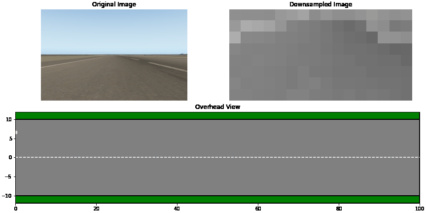

# Stanford AI4ALL 2022
Used neural networks to make a plane autonomously taxi down a runway and take off! [Final project video](https://drive.google.com/file/d/17zHwspgr7HUGuOpp4-EuwP8Fc5IUpUlE/view?usp=sharing)

[Slides Presentation](https://docs.google.com/presentation/d/1zlToXBwHTpcXy77p1CUoKDTNeZQdINMt/edit?usp=sharing&ouid=104013007382217939820&rtpof=true&sd=true)

### Plane Trajectory GIF

Mentors: Keiko Nagami & Roya Firoozi <3
